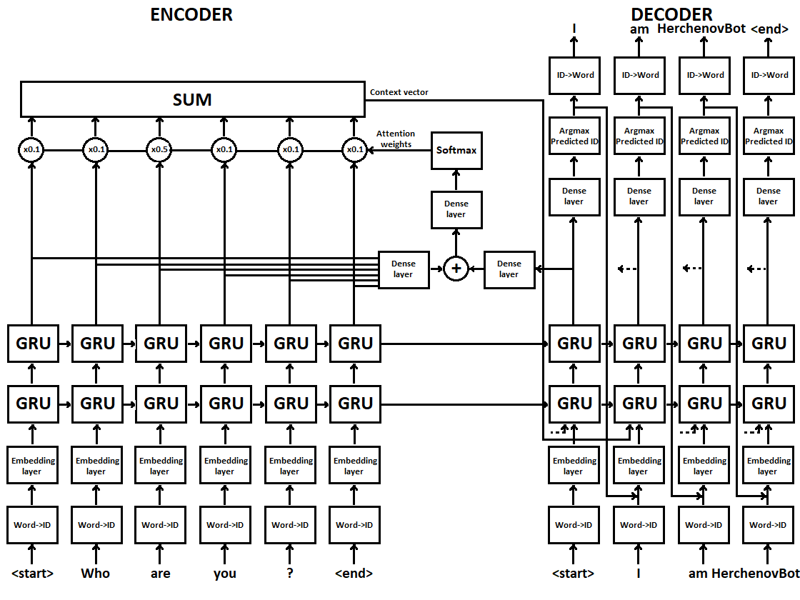

# Сonversational chatbot implemented in TensorFlow(Keras) based on the seq2seq encoder-decoder model with attention

This project is based on the Neural Machine Translation with Attention model, which has been adapted here to fit the needs of a chatbot. Added multi-layer RNN cells for better performance, dropout to prevent overfitting, gradient clipping to avoid "exploding gradients".

## Details

  * Based on the NMT seq2seq encoder-decoder model with attention
  * Bahdanau attention mechanism
  * Tensorflow(Keras) implementation of the algorithm
  * Enabled eager execution
  * Telegram chatbot service as user interface to model
  * python-telegram-bot library as Python interface for the Telegram Bot API
  * Enabled logging

To receive access token write Telegram BotFather http://t.me/BotFather and send command /newbot to create a new bot. Choose a name for your bot. Choose a username for your bot. It must end in 'bot'. BotFather sends you an access token and you put it into the program.
Bot has /start and /help commands, answers to text messages.
dataset.txt includes Papaya Data Set, the scenario conversations designed for training robots, the Cornell movie dialogs and cleaned Reddit data (about 158K pairs). Questions and answers are separated with "\t".
To train model run train.py. When the loss stops diminishing, then we reduce the learning_rate by 2 times.
To start chatbot run chatbot.py. Before this, put the access token into the file.

## Requirements

  * Python 3.6+
  * macOS, Linux, Windows
  * modules:  python-telegram-bot, tensorflow >= 1.10, numpy
  * Nvidia GPU to speed up network training

